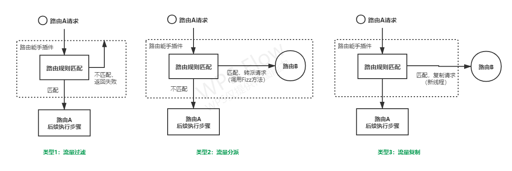

# 路由能手(RouteExpert)

## 简介
   路由能手为Fizz网关插件，提供流量过滤、分派、复制功能，可灵活用于多种场景。

## 功能说明
   1. 本插件功能从类型上可分为流量过滤、分派、复制，原理如下图所示
         
      
      - **流量过滤**：满足匹配规则的请求会被继续执行。可用于访问安全、请求方限制、请求过滤等场景。
      - **流量分派**：满足匹配规则的请求会被转到目标路由执行，不满足的请求在当前路由继续执行。可用于服务分线/业务级别负载均衡、灰度验证、ABTest等场景。
      - **流量复制**：原请求在当前路由正常执行，满足匹配规则的请求则复制一份到目标路由执行。可用于请求复制/流量回放、旁路分析等场景。

       配置时不依赖外部系统，随时可用。
   2. 支持是否启用某条路由规则，启用后选择分派或复制其中一种路由方式。
   3. 支持根据接口路径、来源IP、Header、Cookie、请求参数等多种条件筛选请求，每种条件支持多个参数项，参数值支持单个或多个固定值、或任意非空值。
   4. 分派或复制时可设置请求接收方为其它Fizz路由，巧妙复用。基于Fizz当前设计和支持，本插件分派为函数调用（不产生新请求），复制则为异步线程请求当前服务实例。

## 使用说明
 
   1. 目前提供三条可配置规则，可修改插件表单定义自行扩展数量。分派规则如果设置了多条，将依次检测，如果有一条匹配则不再继续，如果都不匹配，流量过滤（即不配置目标路由）模式下返回失败，流量分派（配置了目标路由）模式下由当前路由继续执行。
      复制规则可以有多条且各自独立，被复制的请求其执行结果不影响原请求。 

   2. 配置接口路径、来源IP、Header、Cookie、请求参数时请按配置界面提示的格式，这几项匹配条件为并的关系。

   3. 目标路由填写时需输入多项值（格式按提示），注意不可以是当前路由。如果填写了目标路由但填写错误（例如路由不存在或填值不规范）那么将请求转到目标路由时会失败。ps:未来Fizz支持使用路由唯一ID时本插件再升级此处填值方式的友好性。 
   
   详细的表单定义请查阅“表单定义.md”，插件配置示例请查看“配置示例.PNG”。

## 依赖说明

   基于fizz社区版，使用2.4.0-SNAPSHOT版本的fizz-spring-boot-starter ，没有依赖其它外部包。